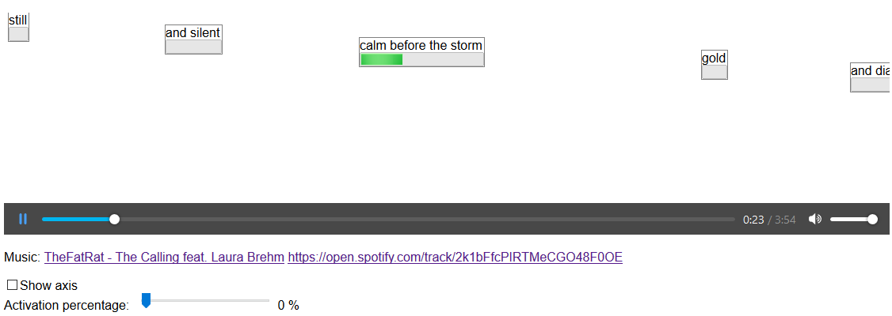

# CSS Merry-go-round

This repository showcases a CSS solution for a "merry-go-round" style sliding showcase.

[**DEMO**](https://tomashubelbauer.github.io/css-merry-go-round/)

- There is a main position of the carousel
- There is a set of items each with their own position and duration
- Items are placed so that they are centered around the main axis with percentage offset given by activation percentage
    - 0 % means the item is to the right of the axis when its position is equals to the main position
    - 50 % means the item is dead center through the axis when its position is equals to the main position
    - 100 % means the item is to the left of the axis when its position is equals to the main position
- Items slide from left to right relative to the difference of their position and main position
- Items show a progress bar set at the proportion of the items position (min) and the items position combined with its duration (max) relative the to main position (value)

## To-Do

### Lift this to be its own lyrics timing app
